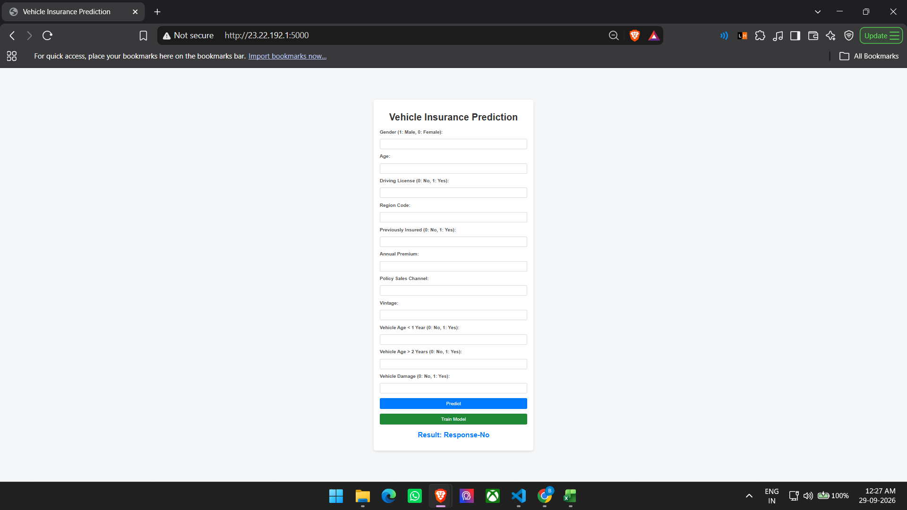
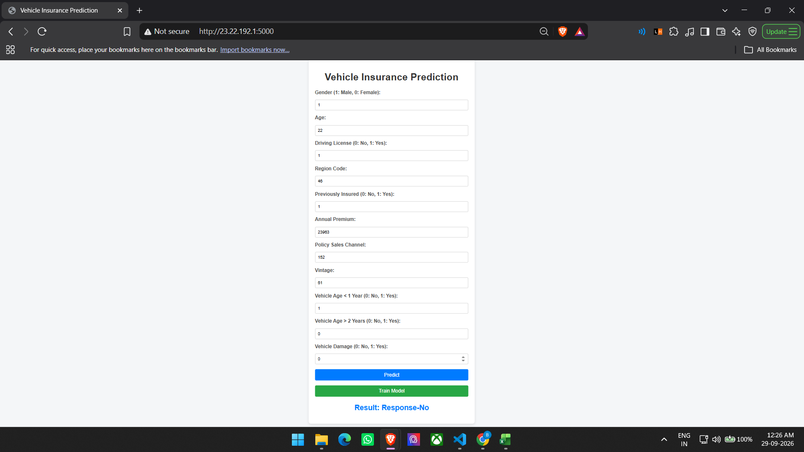
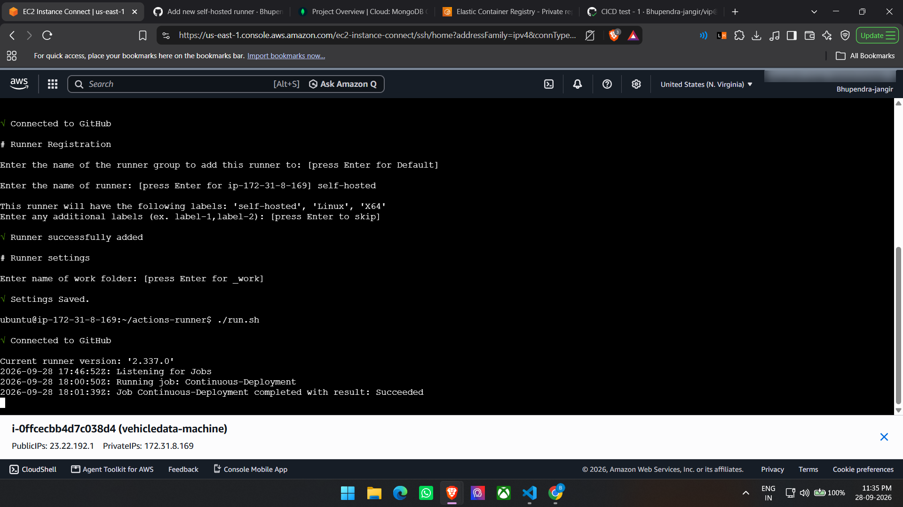
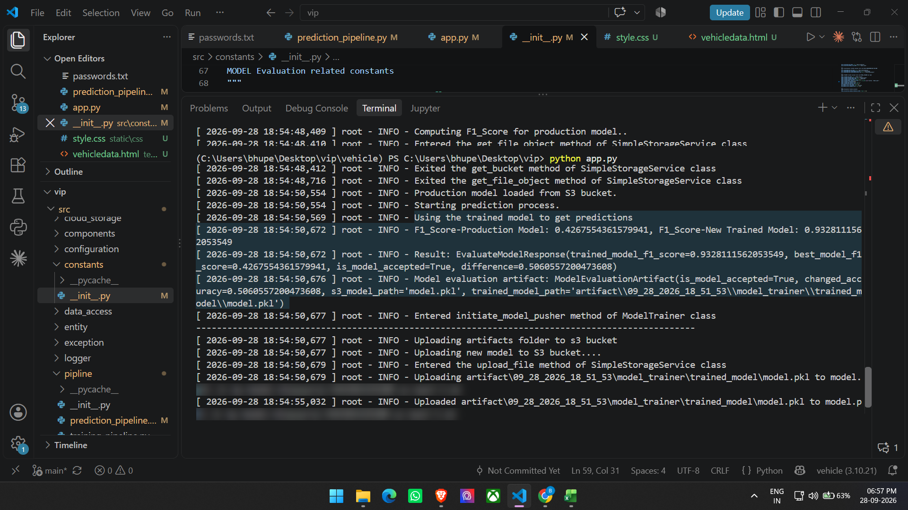
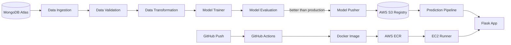

<div align="center">

# 🚗 Vehicle Insurance Prediction — End-to-End MLOps Project

**MongoDB Atlas → modular training pipeline → AWS S3 model registry → Flask app → Docker → GitHub Actions CI/CD → AWS EC2**


🔗 **Repo:** [github.com/Bhupendra-jangir/vip](https://github.com/Bhupendra-jangir/vip)  
🌐 **Live demo:** [http://23.22.192.1:5000](http://23.22.192.1:5000)

> ℹ️ The AWS resources were shut down to avoid charges, so the live link may be offline. The screenshots below show the fully working system.



</div>

---

## 📌 Table of Contents

[Overview](#-overview) · [Features](#-features) · [Screenshots](#-project-in-action) · [Architecture](#-architecture) · [Pipeline Components](#-pipeline-components) · [Project Structure](#-project-structure) · [Setup](#-project-setup) · [AWS & CI/CD](#-aws-and-cicd-deployment) · [Usage](#-usage) · [Troubleshooting](#-troubleshooting) · [Security](#-security-notes) · [Cleanup](#-cleanup) · [Contributing](#-contributing)

## 🔍 Overview

A complete MLOps pipeline that covers **data ingestion, validation, transformation, model training, evaluation, deployment and prediction** for vehicle insurance data. Data is stored in **MongoDB Atlas**, the best model is versioned in an **AWS S3 model registry**, and a **Flask** app serves predictions. The app is packaged with **Docker** and deployed to **AWS EC2** automatically on every push through **GitHub Actions** (self-hosted runner).

## 🎯 Features

- ✅ **Automated data pipeline:** ingest, validate and transform data from MongoDB Atlas
- ✅ **Model training and evaluation:** a new model is pushed only if it beats the production model by the set threshold (`0.02`)
- ✅ **Cloud storage and deployment:** AWS S3 for model storage, EC2 for hosting
- ✅ **CI/CD pipeline:** automated deployment via GitHub Actions, ECR and EC2
- ✅ **Dockerized app:** containerized for smooth deployment and scaling
- ✅ **Schema validation:** dataset structure enforced through `config/schema.yaml`
- ✅ **Logging and exception handling:** custom logger and exceptions for easy debugging
- ✅ **Retraining on demand:** *Train Model* button / `/training` route

## 🎬 Project in Action

### 🖥 Web app

| Data form | Prediction page |
|:---:|:---:|
|  |  |

### 🔁 CI/CD: self-hosted runner on EC2

The runner connected to GitHub, picked up the `Continuous-Deployment` job, and completed it successfully.

<div align="center">

</div>

### 🧪 Training and model evaluation

The new model scored an F1 of **~0.93** against **~0.43** for the production model, so it was accepted and uploaded to S3.

<div align="center">

</div>

## 🏗 Architecture



## ⚙️ Pipeline Components

| # | Component | What it does |
|---|---|---|
| 1 | **Data Ingestion** | Fetches records from MongoDB (`data_access/proj1_data.py`), converts them to a DataFrame, and creates train/test splits. |
| 2 | **Data Validation** | Checks columns and dtypes against `config/schema.yaml`. |
| 3 | **Data Transformation** | Preprocessing and feature engineering; saves the transformer and transformed data. |
| 4 | **Model Trainer** | Trains the model and wraps it in the estimator class (`entity/estimator.py`). |
| 5 | **Model Evaluation** | Compares the new model with the production model in S3 using F1 score. |
| 6 | **Model Pusher** | Uploads the accepted model to S3 via `aws_storage` and `entity/s3_estimator.py`. |
| 7 | **Prediction Pipeline** | Loads the production model from S3 and serves predictions through `app.py`. |

Each component follows the same build pattern: constants → config entity → artifact entity → component → training pipeline → test with `demo.py`.

## 📁 Project Structure

```text
.
├── .github/workflows/aws.yaml   # CI/CD workflow
├── assets/screenshots/          # README images
├── config/schema.yaml           # Dataset schema for validation
├── notebook/                    # mongoDB_demo.ipynb + EDA / feature engineering
├── src/
│   ├── aws_storage/             # S3 pull/push
│   ├── components/              # ingestion, validation, transformation,
│   │                            # trainer, evaluation, pusher
│   ├── configuration/           # mongo_db_connections.py, aws_connection.py
│   ├── constants/               # Project constants
│   ├── data_access/             # MongoDB -> DataFrame
│   ├── entity/                  # config/artifact entities, estimator, s3_estimator
│   ├── exception/  logger/  utils/
│   └── pipline/                 # training and prediction pipelines
├── static/  templates/          # Frontend
├── app.py  demo.py  template.py
├── Dockerfile  .dockerignore
└── requirements.txt  setup.py  pyproject.toml
```

## 🏗 Project Setup

### Step 1: Clone and create the environment

```bash
git clone https://github.com/Bhupendra-jangir/vip.git
cd vip

python template.py                     # first-time project skeleton only
conda create -n vehicle python=3.10 -y
conda activate vehicle
```

### Step 2: Install dependencies

```bash
pip install -r requirements.txt        # also installs local packages via setup.py / pyproject.toml
pip list                               # confirm local packages are installed
```

### Step 3: Set up MongoDB Atlas 📦

1. Sign up at [MongoDB Atlas](https://www.mongodb.com/atlas) and create a new project.
2. Create a cluster: select the **M0 free tier** and deploy.
3. Create a DB user with a username and password.
4. Under **Network Access**, add `0.0.0.0/0` (accessible from anywhere; for learning only, see [Security](#-security-notes)).
5. Get the connection string: `mongodb+srv://<username>:<password>@cluster.mongodb.net/`

### Step 4: Push data to MongoDB

- Place the dataset in the `notebook` folder and load it into Atlas using `mongoDB_demo.ipynb` (kernel: `vehicle`).
- Verify under **Database → Browse Collections**.

### Step 5: Logging and exception handling 📝

- Logger in `src/logger`, custom exception in `src/exception`; both are tested through `demo.py`.

### Step 6: Environment variables 🔐

Never commit credentials.

```bash
# Bash
export MONGODB_URL="mongodb+srv://<username>:<password>@cluster.mongodb.net/"
export AWS_ACCESS_KEY_ID="your_key"
export AWS_SECRET_ACCESS_KEY="your_secret_key"
export AWS_DEFAULT_REGION="us-east-1"
```

```powershell
# PowerShell
$env:MONGODB_URL = "mongodb+srv://<username>:<password>@cluster.mongodb.net/"
$env:AWS_ACCESS_KEY_ID = "your_key"
$env:AWS_SECRET_ACCESS_KEY = "your_secret_key"
$env:AWS_DEFAULT_REGION = "us-east-1"
```

On Windows you can also add them under *System Environment Variables*. Add `artifact/` to `.gitignore`.

### Step 7: Data ingestion, validation, transformation, training 📥

Build each component in the pattern above, using `config/schema.yaml` and `utils/main_utils.py` for validation. Key constants in `src/constants/__init__.py`:

```python
MODEL_EVALUATION_CHANGED_THRESHOLD_SCORE: float = 0.02
MODEL_BUCKET_NAME = "<your-s3-bucket-name>"
MODEL_PUSHER_S3_KEY = "model-registry"
```

### Step 8: Run locally

```bash
python demo.py   # run the training pipeline
python app.py    # start the app at http://localhost:5000
```

### Step 9: Docker (build and test locally) 🐳

```bash
docker build -t vehicleproj .
docker run -p 5000:5000 \
  -e MONGODB_URL="$MONGODB_URL" \
  -e AWS_ACCESS_KEY_ID="$AWS_ACCESS_KEY_ID" \
  -e AWS_SECRET_ACCESS_KEY="$AWS_SECRET_ACCESS_KEY" \
  -e AWS_DEFAULT_REGION="us-east-1" \
  vehicleproj
```

## ☁️ AWS and CI/CD Deployment

1. **IAM:** create a user (e.g. `firstproj`) in `us-east-1` and generate CLI access keys. The project used `AdministratorAccess`; least-privilege (S3 + ECR) is safer.
2. **S3:** create a bucket for the model registry (e.g. `my-model-mlopsproj`) and set it in the constants.
3. **Deployment IAM user:** create a second user for CI/CD (e.g. `usvisa-user`) with its own access keys.
4. **ECR:** create a repository (e.g. `vehicleproj`) and copy its URI.
5. **EC2:** launch an Ubuntu 24.04 instance (`vehicledata-machine`, `t2.medium`, 30 GB, HTTP/HTTPS allowed) and connect with EC2 Instance Connect.
6. **Install Docker on EC2:**
   ```bash
   curl -fsSL https://get.docker.com -o get-docker.sh
   sudo sh get-docker.sh
   sudo usermod -aG docker ubuntu
   newgrp docker
   ```
7. **Self-hosted runner:** GitHub → **Settings → Actions → Runners → New self-hosted runner** (Linux). Run the download and configure commands on EC2, then start it with `./run.sh`. It should show as *Idle*.
8. **GitHub secrets** (**Settings → Secrets and variables → Actions**): `AWS_ACCESS_KEY_ID`, `AWS_SECRET_ACCESS_KEY`, `AWS_DEFAULT_REGION`, `ECR_REPO`.
9. **Open port 5000:** EC2 → Security Group → Edit inbound rules → Custom TCP, port `5000`, source `0.0.0.0/0`.
10. **Deploy:** commit and push to trigger the workflow, then open `http://<public-ip>:5000`.

## 💻 Usage

| Action | How |
|---|---|
| Predict | Fill in the form and click **Predict** |
| Retrain | Click **Train Model** or visit `/training` |

Form inputs: gender, age, driving license, region code, previously insured, annual premium, policy sales channel, vintage, vehicle age (< 1 year / > 2 years) and vehicle damage. The result is shown as `Response-Yes` or `Response-No`.

## 🩺 Troubleshooting

| Problem | Fix |
|---|---|
| App won't open in the browser | Check the security group allows port `5000` and the container is running (`docker ps`) |
| Runner isn't picking up jobs | Restart it with `./run.sh` and confirm it shows *Idle* in GitHub |
| `permission denied` for Docker on EC2 | Run `sudo usermod -aG docker ubuntu` then `newgrp docker` |
| MongoDB or AWS errors | Make sure `MONGODB_URL` and the AWS variables are set in the same terminal session |
| Can't connect to Atlas | Check Network Access includes your IP and the password in the URI is URL-encoded |

## 🛡 Security Notes

- Use least-privilege IAM policies and rotate access keys.
- Restrict MongoDB Network Access to known IPs and keep S3 buckets private.
- Never commit secrets or files like `passwords.txt`; keep them in `.gitignore`.

## 🧹 Cleanup

To stop AWS charges: terminate EC2 → delete ECR repo → empty and delete the S3 bucket → delete IAM keys → remove the GitHub runner → pause or delete the Atlas cluster.

## 🔮 Future Improvements

MLflow tracking · drift monitoring · automated tests in CI · Terraform · scheduled retraining · HTTPS with a custom domain

## 🤝 Contributing

Contributions are welcome! Fork the repo, create a feature branch, and submit a pull request.

---

<div align="center">⭐ If you found this project useful, consider giving it a star!</div>